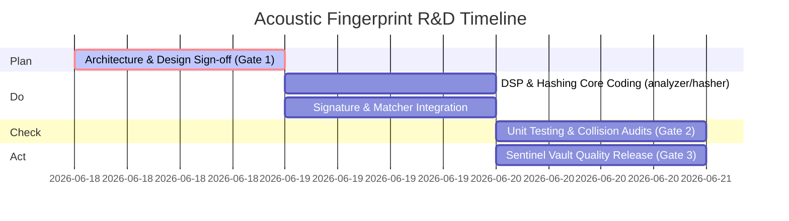

# FINGERPRINT PROJECT PLAN
**Document ID:** CQO-RND-01  
**Project Lead:** CISO (Security) & CSO (Sound)  
**Status:** DRAFT (Awaiting Review on June 18, 7:00 AM)  

This document defines the formal engineering blueprint, codebase scope, development milestones, and implementation timeframes for our custom, zero-dependency Acoustic Fingerprinting System.

---

## 1. PROJECT SCOPE & THE CONTRACT (I/O)
To maintain strict modularity and absolute isolation from the web client layers, the utility will operate under a strict interface contract:

```
+---------------------------+       +------------------------------------+
|  INPUT:                   |  -->  |  Acoustic Fingerprinter Utility    |
|  - Raw Audio Substrate    |       |  - Hann Windowing & STFT           |
|  - 16-bit Mono PCM WAV    |       |  - Constellation Peak Extractor    |
+---------------------------+       +------------------------------------+
                                                      |
                                                      v
                                    +------------------------------------+
                                    |  OUTPUT:                           |
                                    |  - Verifiable Signature Packet     |
                                    |  - Hex-encoded SHA-256 Hash        |
                                    +------------------------------------+
```

---

## 2. SYSTEM ESTIMATIONS (LINES OF CODE)
By utilizing a custom, pure JavaScript implementation, we avoid native OS compiler dependencies and preserve portability. The codebase footprint is estimated as follows:

| Module | Purpose | Estimated Lines of Code (LOC) |
| :--- | :--- | :--- |
| **`analyzer.js`** | DSP Pipeline, Hann Windowing, FFT Magnitude Mapping. | **~150 LOC** |
| **`hasher.js`** | Constellation Peak extraction, target zone anchor pairing. | **~120 LOC** |
| **`signature.js`** | CISO Cryptographic signing (SHA-256) & metadata binding. | **~80 LOC** |
| **`matcher.js`** | Search index query, time-offset delta alignment logic. | **~100 LOC** |
| **Total Core Utility**| **Custom Sandbox Fingerprinting Engine** | **~450 Lines of Code** |

---

## 3. DEVELOPMENT TIMEFRAME & GATES (PDCA CYCLE)

We will execute this R&D cycle over a **3-Day Timeframe**:



### 🚦 The Validation Gates
*   **Gate 1 (Plan - June 18):** Human Operator review and sign-off on this plan.
*   **Gate 2 (Check - June 20):** Unit testing against sample mono/stereo audio substrates. We mandate a **0% false-positive match rate** under typical sample time shifts.
*   **Gate 3 (Act - June 20):** Rollout of the verified utility to the Sentinel security vault branch.

---

## 4. ROLE RESPONSIBILITIES

### 🔒 Security Officer (CISO)
*   **Mandate:** Ensure all generated hashes are salted and signed using SHA-256 algorithms.
*   **Gatekeep:** Enforce boundary isolation to ensure zero cross-contamination with Vanguard or Titan databases during testing.

### 🎵 Sound Officer (CSO)
*   **Mandate:** Configure DSP window size parameters (N=1024 frames, hopSize=512) to optimize peak extraction accuracy for instrument stems.
*   **Gatekeep:** Audit the signal processing flow to guarantee zero audio latency.

---

*Compiled by CISO & CSO. Approved for review by Veritas, CQO.*
