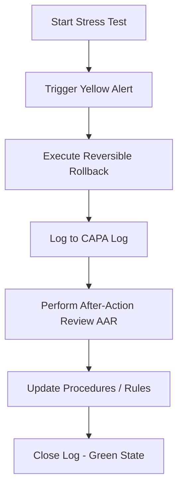

# AFTER-ACTION REVIEW (AAR) PROCEDURE
**Document ID:** CQO-SOP-04  
**Owner:** Chief Quality Officer (Veritas)  
**Reference:** ISO 9001:2026 Clause 10.3 (Continual Improvement)  
**Status:** ACTIVE  

This document defines the mandatory After-Action Review (AAR) procedure to be executed immediately following the completion of any SPC Stress Test or internal audit.

---

## 1. PURPOSE OF THE AAR
The After-Action Review is a structured, post-operational evaluation tool designed to identify the gap between expected and actual performance, diagnose successes and failures, and document lessons learned. It ensures that stress testing is not just a configuration check, but a driver for continuous system improvement.

---

## 2. THE 4 CORE AAR QUESTIONS
Each AAR must explicitly answer the following four questions:
1.  **What was expected to happen?** (Define the planned parameters, test thresholds, and expected alerts).
2.  **What actually occurred?** (Document the real-time system responses, latency figures, blocked request logs, or error codes).
3.  **What went well and why?** (Highlight successful system defense, rapid alert triggers, or immediate rollback execution).
4.  **What can be improved and how?** (Identify system weaknesses, script misconfigurations, layout shifts, or optimization opportunities).

---

## 3. FLOW OF OPERATION


1.  **Immediate Execution:** The AAR must be compiled within 2 hours of restoring the system to a Green state.
2.  **Audit Sign-off:** The CQO must review the AAR and attach the findings to the ISO Internal Audit Sign-off Matrix.
3.  **Continuous Integration:** Any improvements identified (e.g., updating CSP domains, optimizing database queries) must be scheduled as backlog items.

---

## 4. MASTER AAR TEMPLATE (REUSABLE)
Use the following template to document all reviews. File naming convention: `C-Suite_Logs/AAR_YYYY-MM-DD_[Department].md`.

```markdown
# AFTER-ACTION REVIEW: [STRESS TEST NAME / AUDIT ID]
**Date:** YYYY-MM-DD  
**Department Under Review:** [e.g., CISO, CSO, CTO]  
**Lead Auditor:** Veritas (CQO)  

### 1. Objectives & Expectations
*   *Planned Stress Vector:* [What parameter was adjusted?]
*   *Expected Trigger:* [Expected Yellow/Red Light threshold]

### 2. Actual Performance & Chronology
*   *Event Timestamp:* [Time of injection]
*   *Observed Response:* [Console logs, alert messages, errors caught]
*   *Rollback Completion:* [Reversion confirmation]

### 3. The 4 Questions
1.  **What was expected to happen?**
    *   ...
2.  **What actually occurred?**
    *   ...
3.  **What went well and why?**
    *   ...
4.  **What can be improved and how?**
    *   ...

### 4. Corrective and Preventive Actions (CAPA) Alignment
*   *CAPA Log ID:* [e.g., CQO-CAPA-LOG-XXX]
*   *Identified Actions:* [What steps will prevent recurrence or optimize behavior?]

### 5. Sign-offs
*   *CQO (Veritas) Sign-off:* [Approved/Pending]
*   *Department Lead Sign-off:* [Approved/Pending]
```

---
*By order of Veritas, Chief Quality Officer. Turning operational logs into institutional intelligence.*
