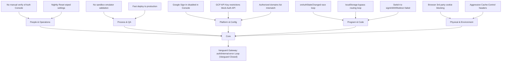

# CAPA Report: Vanguard Authentication Loop & Gateway Refusal
**Document ID:** CQO-CAPA-0620  
**Date:** June 20, 2026  
**Pillar Affected:** Vanguard (`full-armor-vanguard.web.app`)  
**Status:** `UNDER INVESTIGATION`  
**Active Officer:** Chief Quality Officer (Veritas / Rita)  
**Collaborating Officer:** Chief Technology Officer (Gav)

---

## 1. Problem Description
Upon re-authenticating the workspace and loading the Vanguard portal, the system enters a redirect loop or fails with a hard popup/redirect alert: `Protocol Refused: FirebaseError (auth/internal-error)`. The "Vanguard Gateway" lobby fails to authorize user credentials, preventing access to the underlying music catalog.

---

## 2. Root Cause Analysis (RCA)

### 2.1 The 5 Whys Analysis
1. **Why is the Vanguard portal closed to the music?**  
   *Answer:* The Google Google Sign-In handshake fails immediately, triggering a generic `auth/internal-error` exception, leaving the user unauthenticated and stuck in a redirect loop between the lobby and terminal pages.
2. **Why does the `auth/internal-error` exception occur?**  
   *Answer:* Firebase Auth's underlying `signInWithRedirect` and `signInWithPopup` methods are rejected by the authentication server when attempting to negotiate OAuth credentials.
3. **Why does the authentication server reject the OAuth handshake?**  
   *Answer:* There is a structural configuration mismatch. The Google Sign-In provider is likely disabled in the newly reset Firebase Console for the `full-armor-vanguard` project, or the GCP API Key has restrictions that do not permit traffic from the Identity Toolkit API on the hosting domain.
4. **Why does the page loop instead of showing a clean error state?**  
   *Answer:* Because the client-side authentication listeners (`onAuthStateChanged`) immediately redirect the browser to `index.html` on credential absence, while `index.html` synchronously checks `localStorage` flags and attempts to push the user back to `vanguard_terminal.html`, creating a cyclic redirect loop.
5. **Why was this configuration discrepancy not captured prior to deployment?**  
   *Answer:* Because we deployed code changes directly to production hosting without executing local validation in the Firebase Emulator sandbox to check the auth provider status.

---

### 2.2 Fishbone (Ishikawa) Diagram

---

## 3. Action Plan: 5S Code & Configuration Cleanup
To clean up the environment and standardise the fix, we will execute a 5S operation on Vanguard's auth routing:

1. **Sort (Seiri):** Remove redundant and conflicting redirect checks (such as the `localStorage.getItem("vanguard_manifesto_verified")` bypass in `index.html`) to ensure a single, clean source of truth for auth state.
2. **Straighten (Seiton):** Reorganize the `onAuthStateChanged` hook so it strictly evaluates the Firebase User object first before checking local storage.
3. **Shine (Seiso):** Audit and clean up the Javascript console errors by wrapping the Auth calls in structured try/catch blocks that gracefully handle `auth/internal-error` without alert popups.
4. **Standardize (Seiketsu):** Standardize redirect-based auth across Vanguard, Titan, and Noble using a shared authentication wrapper.
5. **Sustain (Shitsuke):** Document this architecture in `AGENTS.md` and ensure that the Firebase Emulator is used to test auth flows before any future production deploys.

---

## 4. Verification & Debugging Instructions for the Operator
To isolate and confirm the root cause without taking premature code actions, the Operator should assist us with the following checks:

### Step 4.1: Inspect the Browser Network Tab
1. Open Chrome Developer Tools (**F12** or **Ctrl+Shift+I**) on the terminal page.
2. Go to the **Network** tab and filter by `Fetch/XHR`.
3. Attempt to log in. Look for the outbound request to:
   `https://identitytoolkit.googleapis.com/v1/accounts:signInWithIdp?...`
4. Inspect the JSON response body.
   * If the response returns an error saying **`CONFIGURATION_NOT_FOUND`** or **`OPERATION_NOT_ALLOWED`**, Google Sign-In is disabled in the Firebase Console.
   * If the response returns **`API_KEY_HTTP_REFERRER_BLOCKED`**, the GCP API Key is restricted and blocking the domain.

### Step 4.2: Verify Firebase Console Settings
1. Log into the [Firebase Console](https://console.firebase.google.com/).
2. Select the **`full-armor-vanguard`** project.
3. Go to **Build** -> **Authentication** -> **Sign-in method**.
4. Confirm that **Google** is listed as an **Enabled** provider. If not, enable it and save.
5. Go to **Settings** -> **Authorized domains** and verify that `full-armor-vanguard.web.app` and `localhost` are listed.
